# 🌐 Linux Web Services Project

## 🎯 Purpose
**Hands-on experience with secure, remote web services on Linux**  
This project teaches you to:
- Deploy a production-like web service
- Configure secure database connectivity
- Implement proper access controls
- Troubleshoot multi-server architectures

## 📌 Core Requirements
```diff
+ Must Complete:
1. Two AWS Linux instances (Web + DB)
2. WordPress via Apache/PHP
3. MariaDB with remote access
4. Proper security groups
5. Static IP configuration

! Bonus Opportunities:
- Add HTTPS encryption
- Implement automated backups
- Create monitoring alerts
```
### 🧠 Learning Outcomes ###
Area	Skills Gained
Infrastructure	AWS EC2, Security Groups, Networking
Security	Principle of Least Privilege, Firewalls
Web Stack	LAMP (Linux, Apache, MySQL, PHP)
Troubleshooting	Log analysis, Connectivity testing
⏱️ Project Timeline
Week 1-2: Environment setup

Week 3-4: Service configuration

Week 5: Security hardening

Week 6: Final testing & documentation

[](https://aws.amazon.com)
[](https://wordpress.org)
[](https://mariadb.org)
[](https://mariadb.com/kb/en/mariadb-vs-mysql-compatibility/)

## 📋 Table of Contents
- [Architecture](#-architecture-overview)
- [Setup Guide](#-aws-setup-guide)
- [Security](#-security-configuration)
- [Validation](#-network-validation)
- [Deliverables](#-project-deliverables)

## 📊 Architecture Overview

```mermaid
graph TD
    A[🌐 Internet] -->|Ports 80/443| B[🖥️ Web Tier<br><sub>t3a.nano • Amazon Linux 2023</sub>]
    B -->|3306 → CSCI2790WebSG| C[🗃️ DB Tier<br><sub>t3a.nano • MariaDB 10.5</sub>]
    D[🔍 Validation Host] -.->|Blocked| C
    classDef web fill:#e1f5fe,stroke:#039be5
    classDef db fill:#e8f5e9,stroke:#43a047
    class B web; class C db
```

### week 1 ###

## 🛠️ AWS Setup Guide


 ### Security Groups ###


###  Web Server ###


```bash
# Web Server (CSCI2790WebSG)
- SSH (22): 0.0.0.0/0
- HTTP (80): 0.0.0.0/0
- HTTPS (443): 0.0.0.0/0
```
### Database ###


```
# Database (CSCI2790DBSG)
- SSH (22): 0.0.0.0/0
- MySQL (3306): CSCI2790WebSG
```
### Instance Deployment ##


### 2. Instance Deployment
```bash
# Web Server
AMI: Amazon Linux 2023
Type: t3a.nano
SG: CSCI2790WebSG

# Database Server
AMI: Amazon Linux 2023 
Type: t3a.nano
SG: CSCI2790DBSG
```

# 🚀 AWS WordPress Deployment - Week 2+  
**Three-Tier Architecture: Web + DB + Test Server**  

## 📋 Project Overview  
- **Web Server**: Apache + PHP + WordPress  
- **DB Server**: MariaDB 10.5  
- **Test Server**: Security validation host  
- **Infra**: Amazon Linux 2023 (t3a.nano)  

## 🔒 Security Groups  
| Group Name         | Inbound Rules                          | Purpose                  |
|--------------------|----------------------------------------|--------------------------|
| `CSCI2790WebSG`    | SSH 22 (0.0.0.0/0), HTTP 80 (0.0.0.0/0)| Web server access        |
| `CSCI2790DBSG`     | SSH 22 (WebSG), MySQL 3306 (WebSG)     | DB server access         |
| `CSCI2790TestSG`   | SSH 22 (Your-IPv4/32)                  | Security validation      |

## 🛠️ Week 2 Setup  

### 1️⃣ Launch All EC2 Instances  

###  Test Server ###


```bash
# Test Server (Add this to your setup)
AMI: Amazon Linux 2023  
Type: t3a.nano  
SG: CSCI2790TestSG  
Hostname: testserver  
IP: Auto-assign public IPv4  `
```

### testGroup ###


# From testserver (should FAIL):
telnet db 3306
nc -zv db 3306

# From webserver (should SUCCEED):
mysql -h db -u wpadmin -p


🚨 Troubleshooting Matrix
Issue	Test Command	Solution
Can't reach DB	telnet db 3306	Check SGs & route tables
SSH connection refused	nc -zv testserver 22	Verify IPv4 in TestSG
Hostname not resolving	ping web vs ping <IP>	Check /etc/hosts


# 🗃️ MariaDB Database Server Configuration

## 🌟 Server Specs
- **Hostname**: db
- **AMI**: Amazon Linux 2023
- **Instance Type**: t3a.nano
- **Security Group**: CSCI2790DBSG
- **Ports**: 3306 (MySQL), 22 (SSH)

## 📌 Installation

### Install MariaDB 10.5 ###


```bash
# Install MariaDB 10.5
sudo amazon-linux-extras install -y mariadb10.5

# Start & enable service
sudo systemctl enable --now mariadb
```
### Verify installation ###
mysql --version
# Should return: mysql Ver 15.1 Distrib 10.5.x-MariaDB


🔐 Secure Configuration


```bash

sudo mysql_secure_installation
 ```

Follow prompts to:

Set root password (use DB$Root2024! format)

Remove anonymous users

Disable remote root login

Remove test database

Reload privileges


### 🛠️ WordPress Database Setup ###


```CREATE DATABASE wordpress;
CREATE USER 'wpadmin'@'web' IDENTIFIED BY 'W0rdPr3$$DB2024!';
GRANT ALL PRIVILEGES ON wordpress.* TO 'wpadmin'@'web';
FLUSH PRIVILEGES;
```


### 🌐 Remote Access Configuration ###

```sudo vi /etc/my.cnf.d/mariadb-server.cnf```

```[mysqld]
bind-address = 0.0.0.0
```


### 🚦 Service Management  ###

# Start/Enable service
```sudo systemctl enable --now mariadb```

# Check status
```sudo systemctl status mariadb```

# View error logs
```sudo tail -f /var/log/mysqld.log```


### 🔍 Connection Testing ###

From web server:

```mysql -h db -u wpadmin -p```


### 🚨 Troubleshooting ###
Issue	Command	Solution
Connection refused	```telnet db 3306```	Check SGs & bind-address
Access denied	```mysql -u root -p```	Verify user privileges
Can't start	```journalctl -xe```	Check disk space


---

### `web-server/README.md` - PHP/Web Server Setup

```
# 🌐 Web Server Setup (Apache/PHP)

## 📦 Package Installation
```bash
# Install LAMP stack
sudo dnf install -y httpd php php-mysqlnd php-gd php-mbstring

# Verify PHP
php -v
# Should return PHP 8.x
```


### 🚀 Apache Configuration ###

# Start services
```sudo systemctl enable --now httpd```

# Open firewall
```sudo firewall-cmd --permanent --add-service={http,https}```
```sudo firewall-cmd --reload```

# Set proper permissions
```sudo chown -R apache:apache /var/www/html```


### 🏗️ WordPress SetuP ###

# Download and extract
```cd``` /tmp
```wget ```https://wordpress.org/latest.tar.gz
```tar -xzf ```latest.tar.gz
```sudo mv``` wordpress /var/www/html/

# Set config
```sudo cp /var/www/html/wordpress/wp-config-sample.php /var/www/html/wordpress/wp-config.php```
```sudo vi /var/www/html/wordpress/wp-config.php```


### Edit these values: ###

```define('DB_NAME', 'wordpress');
define('DB_USER', 'wpadmin');
define('DB_PASSWORD', 'W0rdPr3$$DB2024!');
define('DB_HOST', 'db');
```

### 🛡️ Security Hardening ###

# Restrict directory access
```sudo chmod 750 /var/www/html/wordpress```

# Disable directory listing
```sudo echo "Options -Indexes" >> /etc/httpd/conf/httpd.conf```


### 🧪 Testing ###


# Test PHP processing
```echo "<?php phpinfo(); ?>" | sudo tee /var/www/html/test.php
# Access http://<server-ip>/test.php
```

# Test DB connection
```php -r "new mysqli('db', 'wpadmin', 'W0rdPr3$$DB2024!', 'wordpress');"```


###🚨 Troubleshooting ###
Symptom	Check	Fix
403 Forbidden	```ls -ld /var/www/html```	Correct permissions
White screen	```tail -f /var/log/httpd/error_log```	Check PHP errors
DB connection failed	```telnet db 3306```	Verify credentials


## 📚 Project Deliverables
| Component          | Details                                  |
|--------------------|------------------------------------------|
| Research Paper     | 10+ sources, tech comparisons           |
| Presentation       | Slides + live demo                       |
| AWS Configuration  | Functional 2-tier setup                 |
| Security Report    | Validation host results                 |

## 🚀 Quick Start
1. Clone repo:
   ```bash
   git clone https://github.com/yourusername/cscc-linux-project.git
   ```
2. Follow [Setup Guide](#-aws-setup-guide)
3. Verify with [Validation Tests](#-network-validation)


