# 🚀  Linux+ Project: Secure WordPress on AWS
 - Linux Administration**  
*Tiered AWS deployment with MariaDB backend and security validation*

[](https://aws.amazon.com)
[](https://wordpress.org)
[](https://mariadb.org)

## 📋 Table of Contents
- [Architecture](#-architecture-overview)
- [Setup Guide](#-aws-setup-guide)
- [Security](#-security-configuration)
- [Validation](#-network-validation)
- [Deliverables](#-project-deliverables)

## 📊 Architecture Overview

```mermaid
graph TD
    A[🌐 Internet] -->|Ports 80/443| B[🖥️ Web Tier<br><sub>t3a.nano • Amazon Linux 2023</sub>]
    B -->|3306 → CSCI2790WebSG| C[🗃️ DB Tier<br><sub>t3a.nano • MariaDB 10.5</sub>]
    D[🔍 Validation Host] -.->|Blocked| C
    classDef web fill:#e1f5fe,stroke:#039be5
    classDef db fill:#e8f5e9,stroke:#43a047
    class B web; class C db
```

### week 1 ###

## 🛠️ AWS Setup Guide


 ### Security Groups ###


###  Web Server ###


```bash
# Web Server (CSCI2790WebSG)
- SSH (22): 0.0.0.0/0
- HTTP (80): 0.0.0.0/0
- HTTPS (443): 0.0.0.0/0
```
### Database ###


```
# Database (CSCI2790DBSG)
- SSH (22): 0.0.0.0/0
- MySQL (3306): CSCI2790WebSG
```
### Instance Deployment ##


### 2. Instance Deployment
```bash
# Web Server
AMI: Amazon Linux 2023
Type: t3a.nano
SG: CSCI2790WebSG

# Database Server
AMI: Amazon Linux 2023 
Type: t3a.nano
SG: CSCI2790DBSG
```

## 🔐 Security Configuration
```bash
# MariaDB Secure Installation
$ sudo mysql_secure_installation

# WordPress DB Setup
CREATE DATABASE wordpress;
CREATE USER 'wpuser'@'web-server-ip' IDENTIFIED BY 'StrongPass123!';
GRANT ALL ON wordpress.* TO 'wpuser'@'web-server-ip';
```

## 🔍 Network Validation
```bash
# From Validation Host (should fail)
$ telnet db-server-ip 3306
Connection timed out

# From Web Server (should succeed)
$ mysql -h db-server-ip -u wpuser -p
MariaDB [(none)]> STATUS
```


## 📚 Project Deliverables
| Component          | Details                                  |
|--------------------|------------------------------------------|
| Research Paper     | 10+ sources, tech comparisons           |
| Presentation       | Slides + live demo                       |
| AWS Configuration  | Functional 2-tier setup                 |
| Security Report    | Validation host results                 |

## 🚀 Quick Start
1. Clone repo:
   ```bash
   git clone https://github.com/yourusername/cscc-linux-project.git
   ```
2. Follow [Setup Guide](#-aws-setup-guide)
3. Verify with [Validation Tests](#-network-validation)


